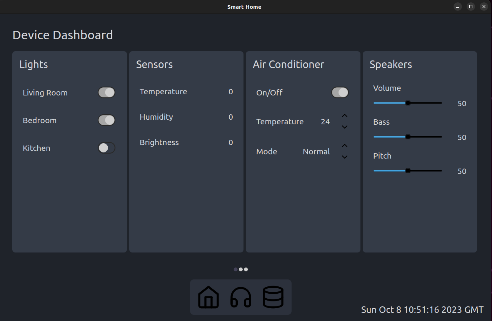
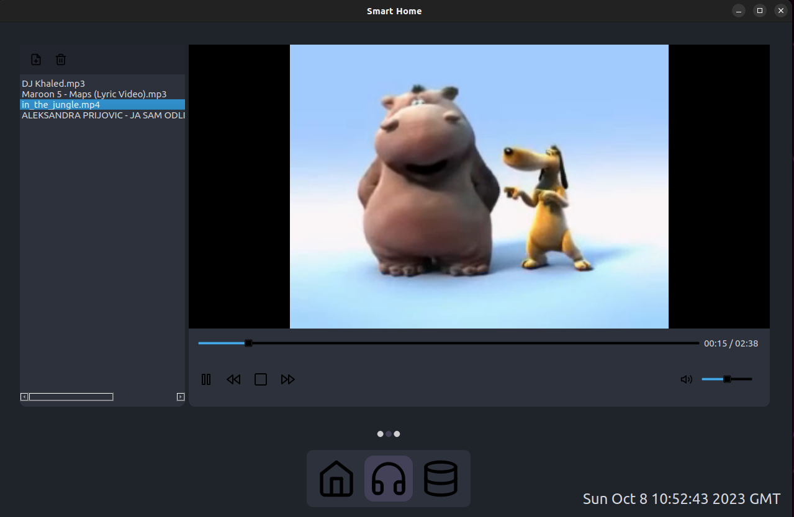

# Description
A smart home application with a GUI and voice commands. Done in with QT, C++ and Python.

It is divided into three pages:
1) Home configuration page
2) Media page
3) Analytics page

# Pages
## Home configuration

This page serves the purpose of viewing and controlling the state of all the sensors, actuators
and other devices attached to SmartHome.

Options this page offers include:
- turning lights on and off 
- controling the air conditioner
- viewing sensor readings (ambient temperature, humidity, brightness etc.)
- controlling the speakers (volume, pitch, bass)

## Media

This page is used to add media files (songs and videos) to a playlist and to play them.

This page also offers the user the following ways to control the media player:
- play/pause/stop the currently selected media
- turn volume up or down
- mute the media player
- seek to any time point in the media which is currently playing

## Analytics

This page offers the user the overview over various analytics which have been gathered
during the SmartHome application runtime. These analytics are displayed in the form of
either a bar graph or a line graph.

The information that can be viewed on this page is:
1) Lights 
    - the amount of time each light was on each hour (within the past 24 hours)
2) AC 
    - the amount of time the AC was on each hour (within the past 24 hours)
    - the AC temperature graph (whenever the AC is off, the temperature value is set to 0)
3) Sensors
    - readings from each sensor (temperature, humidity, brightness) can be seen on a separate graph
