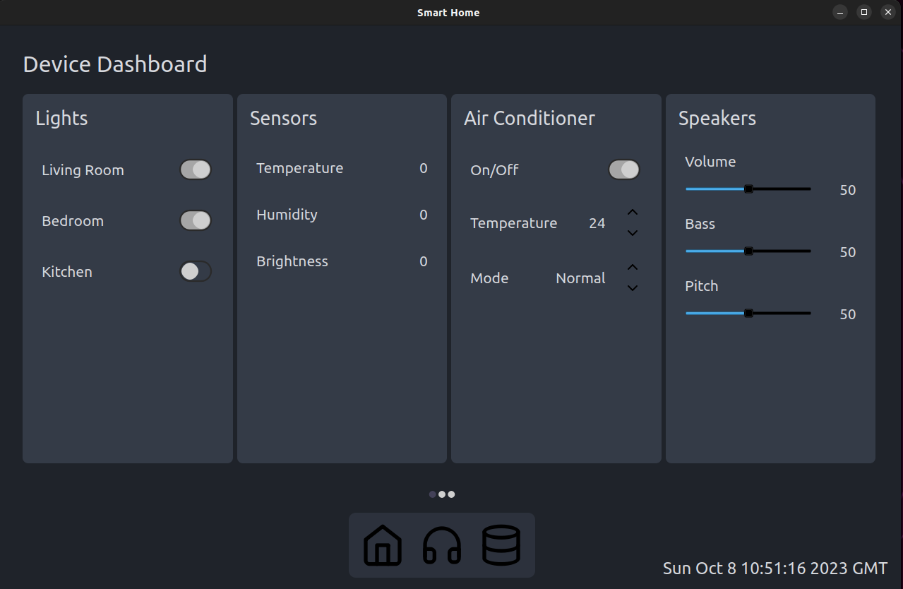
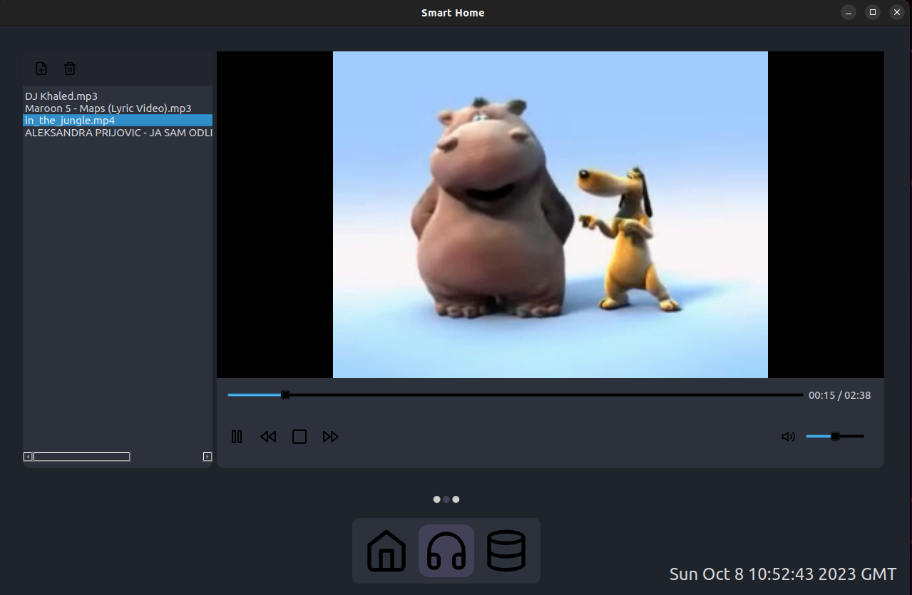
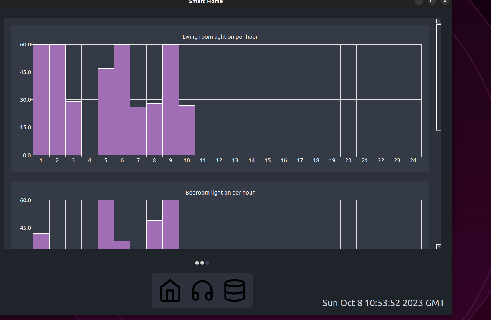

# Description

A smart home application with a GUI and voice commands. Done in with QT, C++ and Python.

It is divided into three pages:

1. Home configuration page
2. Media page
3. Analytics page

# Pages

## Home configuration

This page displays stored sensor values and edits the requested settings for home devices.
Saving settings does not apply them to hardware.



Options this page offers include:

- turning lights on and off
- controling the air conditioner
- viewing sensor readings (ambient temperature, humidity, brightness etc.)
- controlling the speakers (volume, pitch, bass)

## Media

This page is used to add media files (songs and videos) to a playlist and to play them.



This page also offers the user the following ways to control the media player:

- play/pause/stop the currently selected media
- turn volume up or down
- mute the media player
- seek to any time point in the media which is currently playing

## Analytics

This page offers the user the overview over various analytics which have been gathered
during the SmartHome application runtime. These analytics are displayed in the form of
either a bar graph or a line graph.



The information that can be viewed on this page is:

1. Lights
    - requested on-time for each light in up to 24 session-hour buckets
2. AC
    - requested AC on-time in up to 24 session-hour buckets
    - target temperature is unsupported
3. Sensors
    - stored sensor values (temperature, humidity, brightness) sampled on separate graphs


# Building

CMake requires a C++23 compiler with `std::expected`. The default build includes
Qt 5 (5.12 or later) Widgets, Multimedia, MultimediaWidgets, Charts, and Svg.
CMake fetches FTXUI and nlohmann/json on initial configuration.

```sh
cmake -S . -B build
cmake --build build -j 2
```

For a core/TUI build without Qt:

```sh
cmake -S . -B build-tui -DSMARTHOME_BUILD_GUI=OFF
cmake --build build-tui -j 2
```

Requesting GUI mode in that build reports that GUI support is disabled and exits
with an error. The supported build uses CMake; the media backend retains Qt 5's
playlist API.

